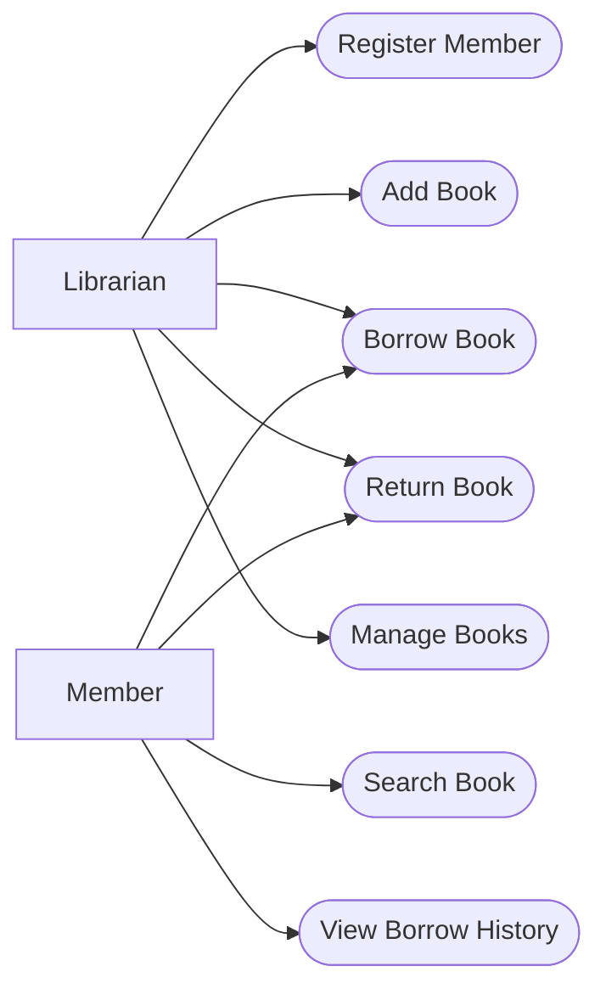
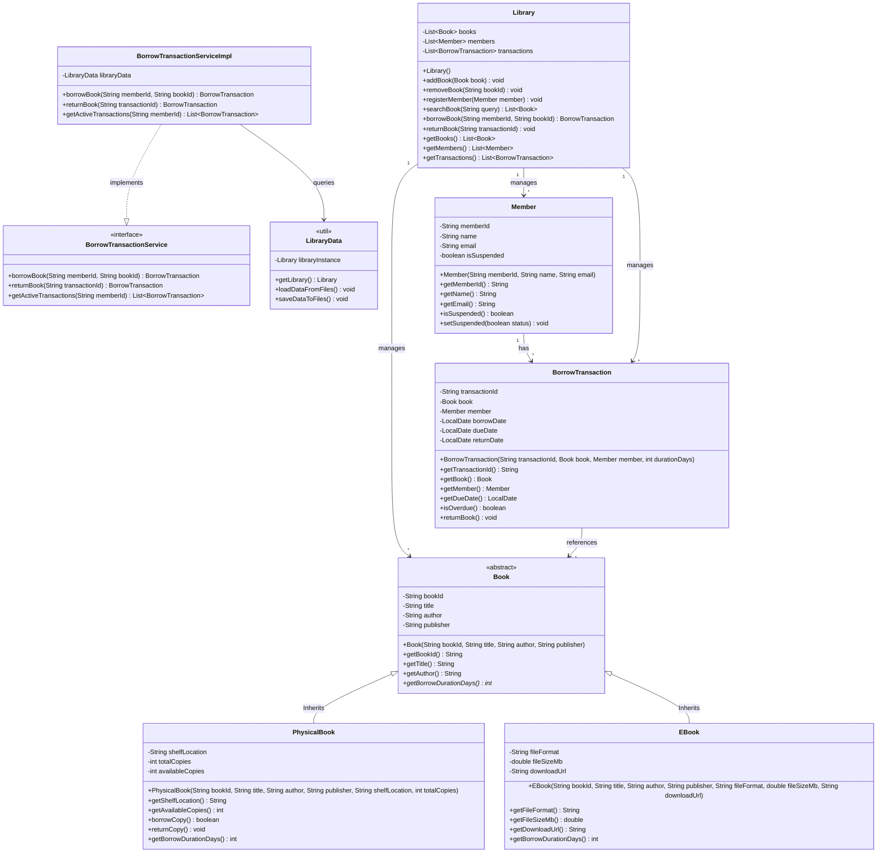
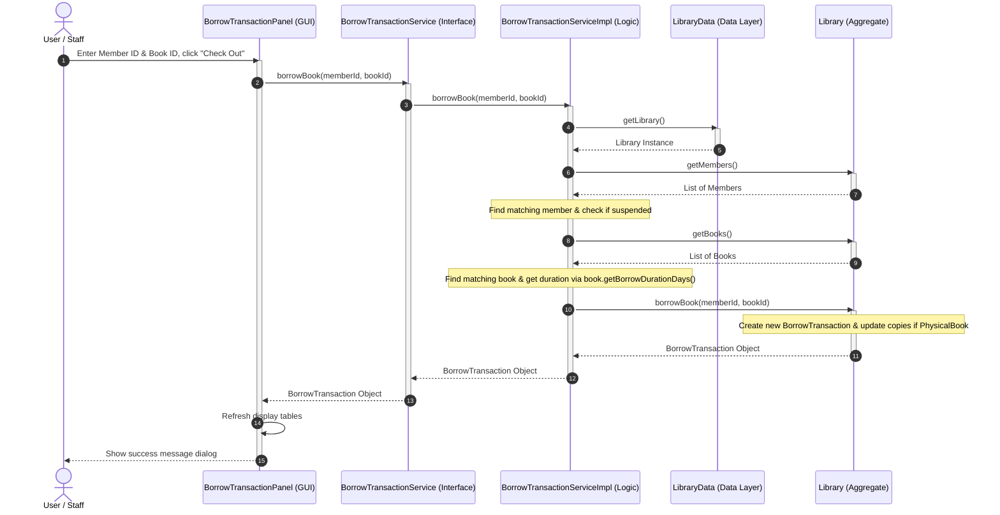

# Project Design Document: Library Management System (LMS)
## Object-Oriented Analysis, Design & Programming Blueprint

---

## 1. Project Overview & Objectives

### Project Overview
The Library Management System (LMS) is a Java desktop application designed to help library staff manage books, register members, and process book check-outs and returns. This system replaces manual paper logs, improving record-keeping accuracy and operational efficiency.

### Objectives
This documentation serves as the technical contract and architectural guide for our three development teams (Architecture, Backend, and Frontend). The primary goals of this project are:
1. **Apply Core OOP Concepts**: Demonstrate concrete understanding of Classes, Objects, Methods, Encapsulation, Inheritance, and Polymorphism in Java.
2. **Follow a Clean Three-Tier Architecture**: Separate user interface layout from business logic rules and data storage.
3. **Collaborate Effectively on GitHub**: Work in parallel using standard git branching procedures, avoiding merge conflicts.

---

## 2. Functional & Non-Functional Requirements

### Functional Requirements
* **Catalog Management**: 
  * Add new books (Physical Books and E-Books) to the system.
  * Search for books by title, author, or identifier.
  * Update book information and remove books from the catalog.
* **Member Management**:
  * Register new library members with unique Member IDs.
  * Update member contact details.
  * View member profiles and active borrow history.
* **Borrow Transaction Processing**:
  * Borrow books (Check Out): Check if a book copy is available, verify member eligibility, and record the transaction.
  * Return books (Check In): Record returns, restore book inventory, and check if a book is returned past the due date.

### Non-Functional Requirements
* **Usability**: The application must feature a clean, intuitive desktop Graphical User Interface (GUI) built with Java Swing or JavaFX.
* **Data Persistence**: Application data (books, members, borrow transactions) must persist between restarts. Data should be saved in simple local files (e.g., CSV or text files) inside the project folder.
* **Platform Portability**: The application must run on any computer with Java Development Kit (JDK) 17 or higher installed.

---

## 3. System Architecture & Folder Structure

We follow a classic **Three-Tier Architectural Pattern**. This ensures that if we decide to change our UI look (e.g. from Swing to JavaFX) or change our file saving code, we only edit one layer without breaking the others.

```
                  ┌─────────────────────────────┐
                  │      Presentation Layer     │  <-- GUI Views & Action Listeners
                  └──────────────┬──────────────┘
                                 │ (Calls service methods)
                  ┌──────────────▼──────────────┐
                  │    Business Logic Layer     │  <-- Services enforcing rules
                  └──────────────┬──────────────┘
                                 │ (Retrieves / updates data)
                  ┌──────────────▼──────────────┐
                  │          Data Layer         │  <-- Memory collections / Files
                  └─────────────────────────────┘
```

### Folder and Package Structure
The project is structured as a single standard Java project. All source code resides in the `src/` directory under the parent package `org.library.system`:

```
src/
└── org/library/system/
    ├── model/         # Core data classes (Encapsulation, Inheritance)
    │   ├── Book.java
    │   ├── PhysicalBook.java
    │   ├── EBook.java
    │   ├── Member.java
    │   ├── BorrowTransaction.java
    │   └── Library.java
    ├── service/       # Service interfaces and implementations (Business Logic)
    │   ├── BookService.java
    │   ├── BookServiceImpl.java
    │   ├── MemberService.java
    │   ├── MemberServiceImpl.java
    │   ├── BorrowTransactionService.java
    │   └── BorrowTransactionServiceImpl.java
    ├── ui/            # GUI Window components (Presentation Layer)
    │   ├── MainFrame.java
    │   ├── BookPanel.java
    │   └── BorrowTransactionPanel.java
    └── util/          # Database mock, CSV file reader/writer (Data Layer)
        ├── LibraryData.java
        └── FileIOHelper.java
```

---

## 4. Demonstrating Object-Oriented Programming (OOP)

The design implements core OOP concepts as follows:

* **Classes and Objects**: Blueprints like `Book`, `Member`, and `BorrowTransaction` define properties and actions. Active books and members are instances (objects) created at runtime. The `Library` class acts as the central object coordinates all collections.
* **Encapsulation**: All class fields are declared `private`. Access is provided via public getters and setters. Input validation is performed within setters or constructors (e.g., throwing an error if copies are set to a negative number).
* **Inheritance**: We define a general base parent class `Book` containing shared attributes (`bookId`, `title`, `author`, `publisher`). We then extend it to specific child classes:
  * `PhysicalBook`: Adds inventory counts (`availableCopies`, `totalCopies`, `shelfLocation`) and represents physical copies stored on shelves.
  * `EBook`: Represents digital downloads, adding digital-specific fields like `fileFormat`, `fileSizeMb`, and `downloadUrl`.
* **Polymorphism**: The parent class `Book` defines an abstract method `getBorrowDurationDays()`. 
  * `PhysicalBook` overrides this method to return `14` (standard two-week loan period for physical copies).
  * `EBook` overrides this method to return `21` (longer three-week rental period for digital downloads).
  * The business logic layer can process a list of generic `Book` objects and dynamically invoke `.getBorrowDurationDays()` at runtime depending on whether the object is a `PhysicalBook` or an `EBook`.

---

## 5. UML Diagrams

### 5.1 UML Use Case Diagram
The Use Case Diagram displays interactions between external actors (Librarians and Members) and the primary system actions.

* **Librarian (Staff)**: Manages catalog data, registers members, and performs check-out and check-in transactions.
* **Member (Reader)**: Searches for books and views their own transactional borrow history.



### 5.2 Package Diagram
This diagram shows how packages are grouped into three logical layers and their dependencies.

```mermaid
graph TD
    subgraph Presentation Layer [ui package]
        MainFrame[MainFrame]
        BookPanel[BookPanel]
        BorrowTransactionPanel[BorrowTransactionPanel]
    end

    subgraph Business Logic Layer [service package]
        SvcInterfaces[Service Interfaces]
        SvcImpls[Service Implementations]
    end

    subgraph Data Layer [util package]
        LibData[LibraryData]
        FileIO[FileIOHelper]
    end

    subgraph Domain Models [model package]
        Entities[Library, Book, PhysicalBook, EBook, Member, BorrowTransaction]
    end

    %% Dependency rules
    Presentation Layer -->|interacts with| Business Logic Layer
    Business Logic Layer -->|implements contracts| SvcInterfaces
    Business Logic Layer -->|manages data via| Data Layer
    
    %% Domain models are used across all layers
    Presentation Layer -.-> Domain Models
    Business Logic Layer -.-> Domain Models
    Data Layer -.-> Domain Models
```

### 5.3 UML Class Diagram
This diagram outlines the fields, methods, and relationships of our primary classes, including proper UML multiplicity notations.



### 5.4 Sequence Diagram: Borrowing a Book
This diagram traces runtime calls when a user processes a book check-out.



---

## 6. Class Responsibilities

| Class | Primary Responsibility | Key Behaviors |
|---|---|---|
| **`Book`** | Abstract base representing any library catalog item. | Stores ID, title, author. Defines abstract `getBorrowDurationDays()`. |
| **`PhysicalBook`** | Concrete book item stored on physical shelves. | Tracks copies. Decrements copies on borrow; increments on return. Overrides `getBorrowDurationDays()` to return `14`. |
| **`EBook`** | Concrete digital book item. | Stores file formats and download links. Overrides `getBorrowDurationDays()` to return `21`. |
| **`Member`** | Stores registration info and status. | Stores ID, name, email. Tracks suspension status. |
| **`BorrowTransaction`** | Tracks checkout records, return dates, and due dates. | Associates a book with a member. Computes if transaction is overdue. |
| **`Library`** | Aggregates all collections. | Acts as the main collection container for Books, Members, and BorrowTransactions. |
| **`LibraryData`** | Coordinates local storage operations. | Reads and writes list records to CSV text files on startup and exit. |
| **`MainFrame`** | The main desktop window layout. | Integrates different tabs (BookPanel, BorrowTransactionPanel) into one window interface. |

---

## 7. Java Service Interfaces

The following simple interfaces represent the programming contract between the Frontend and Backend teams. They are placed in the `service` package.

### `BookService.java`
```java
package org.library.system.service;

import java.util.List;
import org.library.system.model.Book;

public interface BookService {
    /**
     * Adds a new book to the library catalog.
     * @param book The Book to add (PhysicalBook or EBook).
     * @return true if added successfully, false if ID already exists.
     */
    boolean addBook(Book book);

    /**
     * Deletes a book from the library by its ID.
     */
    boolean removeBook(String bookId);

    /**
     * Searches books containing the search text in the title or author.
     */
    List<Book> searchBooks(String query);

    /**
     * Retrieves a book by its unique ID.
     */
    Book getBookById(String bookId);
}
```

### `MemberService.java`
```java
package org.library.system.service;

import java.util.List;
import org.library.system.model.Member;

public interface MemberService {
    /**
     * Registers a new member in the library.
     */
    boolean registerMember(Member member);

    /**
     * Retrieves a member profile by ID.
     */
    Member getMemberById(String memberId);

    /**
     * Suspends or restores a member.
     */
    void setSuspensionStatus(String memberId, boolean isSuspended);
}
```

### `BorrowTransactionService.java`
```java
package org.library.system.service;

import java.util.List;
import org.library.system.model.BorrowTransaction;

public interface BorrowTransactionService {
    /**
     * Attempts to check out a book.
     * @param memberId The ID of the member.
     * @param bookId The ID of the book.
     * @return The created BorrowTransaction record.
     * @throws IllegalArgumentException with a clear message if member is suspended, 
     *                                  book does not exist, or physical copies are out.
     */
    BorrowTransaction borrowBook(String memberId, String bookId) throws IllegalArgumentException;

    /**
     * Returns a borrowed book.
     * @param transactionId The ID of the active transaction.
     * @return The updated BorrowTransaction record with return date set.
     */
    BorrowTransaction returnBook(String transactionId);

    /**
     * Gets all currently active (unreturned) borrow transactions.
     */
    List<BorrowTransaction> getActiveTransactions(String memberId);
}
```

---

## 8. Coding Standards & Naming Conventions

All team members must follow standard Java conventions to keep our shared code easy to read.

### Naming Guidelines
1. **Classes / Interfaces**: Always capitalized CamelCase (`BookService`, `Member`, `BorrowTransaction`).
2. **Methods / Variables**: Starting with a lowercase letter (`availableCopies`, `borrowBook`).
3. **Constants**: All caps with underscores (`MAX_PHYSICAL_BORROW_DAYS = 14`).
4. **Packages**: Lowercase letters, dot-separated (`org.library.system.model`).

### Error Handling & Validation
* Do not leave catch blocks empty. If an error is caught, print a stack trace or log it:
  ```java
  try {
      fileReader.read();
  } catch (IOException e) {
      System.err.println("Failed to read database file: " + e.getMessage());
      e.printStackTrace();
  }
  ```
* For UI input forms, validate fields before sending data to services:
  * Ensure mandatory fields (e.g. Title, Member ID) are not empty.
  * Check that numbers are valid digits.
  * Use simple alerts (`JOptionPane.showMessageDialog`) to display user-friendly error messages when input validation fails.

---

## 9. GitHub Collaboration Workflow

To coordinate work without overwriting each other's code, we will use a simple branch-per-feature workflow.

```
       [main branch] ────────────────────────── (Stable releases)
                      \              /
     [feature branch]  ──────────────           (Where you build your code)
```

### GitHub Rules for the Team:
1. **Never commit directly to `main`**: The `main` branch is reserved for code that compiles and runs perfectly.
2. **Create a branch for every task**: 
   * Name your branch after your task: `git checkout -b feat-book-gui` or `git checkout -b feat-file-saving`.
3. **Keep branches small**: Work on one feature, commit it, and merge it. Do not group multiple screens in one branch.
4. **Create a Pull Request (PR)**: 
   * When your feature is complete, push it to GitHub and open a PR.
   * At least one other team member must review the code, run it locally, and approve it before merging it into `main`.
5. **Resolve Conflicts Locally**: If GitHub warns about merge conflicts, pull the latest `main` into your feature branch locally, fix the conflicting lines in your IDE, and test compilation before updating the PR.

---

## 10. Frontend / Backend Integration Guidelines

Since the Frontend (GUI) and Backend (Logic/Data) are developed by different teams, we align them using standard interface bindings.

### Service Instantiation & Registry
We will use a central access utility `ServiceRegistry` to hold references to our services. This avoids hardcoding new instances everywhere and allows easy swapping:

```java
package org.library.system.util;

import org.library.system.service.BookService;
import org.library.system.service.MemberService;
import org.library.system.service.BorrowTransactionService;

/**
 * Global registry to access service instances from the GUI.
 */
public class ServiceRegistry {
    private static BookService bookService;
    private static MemberService memberService;
    private static BorrowTransactionService borrowTransactionService;

    // Registers the services (usually called in the main() method on startup)
    public static void initialize(BookService bs, MemberService ms, BorrowTransactionService bts) {
        bookService = bs;
        memberService = ms;
        borrowTransactionService = bts;
    }

    public static BookService getBookService() { return bookService; }
    public static MemberService getMemberService() { return memberService; }
    public static BorrowTransactionService getBorrowTransactionService() { return borrowTransactionService; }
}
```

### Integration Workflow
1. **Mock Phase (Parallel work)**:
   * While the Backend team writes file saving routines, the Frontend team can build the GUI panels and use simple, hardcoded list methods to simulate service responses.
2. **Startup Wiring**:
   * In `LMSApplication.java` (the program entry point), we initialize the local data controller, build instances of our services, register them in `ServiceRegistry`, and then load our UI:
   ```java
   public static void main(String[] args) {
       // 1. Initialize data store
       LibraryData data = new LibraryData();
       data.loadDataFromFiles();

       // 2. Initialize logic implementations
       BookService bookService = new BookServiceImpl(data);
       MemberService memberService = new MemberServiceImpl(data);
       BorrowTransactionService borrowTransactionService = new BorrowTransactionServiceImpl(data);

       // 3. Register services
       ServiceRegistry.initialize(bookService, memberService, borrowTransactionService);

       // 4. Start GUI (Swing example)
       SwingUtilities.invokeLater(() -> {
           new MainFrame().setVisible(true);
       });
   }
   ```

---

## 11. Team Responsibilities & Milestones

### Team Assignments
* **Architecture Team**: Oversees interfaces, model class hierarchies (inheritance, polymorphism structure), and ensures code meets class OOP assignment requirements.
* **Backend Team**: Handles service logic implementations (`BookServiceImpl`, etc.) and the data mock layer (`LibraryData`) including CSV file saving/loading.
* **Frontend Team**: Design and implement the GUI layout (Swing/JavaFX frames, panels, dialog boxes) and link button click actions to service methods.

### Project Milestones
1. **Milestone 1 (Design Review)**:
   * Setup repo structure on GitHub.
   * Commit model classes (`Book`, `PhysicalBook`, `EBook`, etc.) and service interfaces to `main`.
2. **Milestone 2 (Draft Implementations)**:
   * Backend builds basic data mocking in memory using `LibraryData` and `Library`.
   * Frontend creates rough GUI screen designs using mock data.
3. **Milestone 3 (Core Integration)**:
   * Backend completes CSV file loading and validation rules.
   * GUI elements are connected to the actual backend services.
4. **Milestone 4 (Testing & Hand-in)**:
   * Team test runs the final jar to ensure data saves correctly on closing.
   * Finalize code documentation, clean up code warnings, and submit the project.
